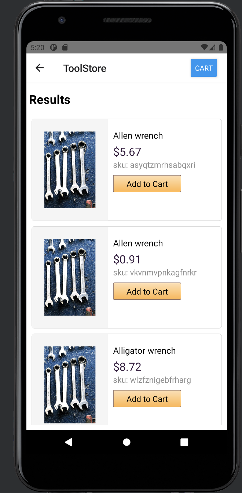
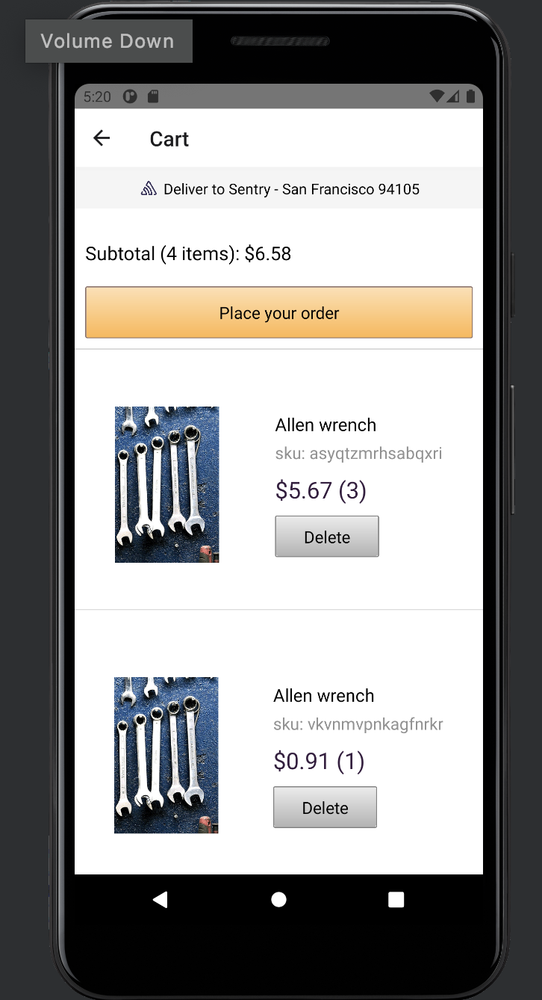

This is demo repo is used by Solution Engineers when demo'ing Sentry's [React Native](https://docs.sentry.io/platforms/react-native) SDK's capabilties.

<!--   -->


[./img](./img) for more screenshots of Empower Plant

## Versions

| dependency      | version
| ------------- |:-------------:|
| react-native     | 0.64.0  |
| gradle           | 6.7     |
| react           | 16.13.1    |
| sentry/react-native      | 2.4.0    |
| npx | 7.8.0 |
| cocoapods | +1.10.1 |

## Setup (Bootstrap)

[INSTALL.md](./Install.md) was written by the CreateReactNativeApp maintainers and outlines some things you'll need.

This step was already performed for adding the sdk to sentry_react_native, but it's good to know it was used as customers will use it:
```
$npx @sentry/wizard -i reactNative -p ios android
```
The above command launches the [Sentry wizard](https://github.com/getsentry/sentry-wizard) allowing you to [link](https://docs.sentry.io/platforms/react-native/#linking) with the correct Sentry react-native project.
From our [documentation](https://docs.sentry.io/platforms/react-native/), the following changes happen which you should be aware of:
```
- add the sentry-android package for native crash reporting on Android
- add the sentry-cocoa package for native crash reporting on iOS
- enable the Sentry Gradle build step for Android
- patch MainApplication.java for Android
- configure Sentry for the supplied DSN in your index.js/App.js files
- store build credentials in ios/sentry.properties and android/sentry.properties.
```

## Setup

1. git clone git@github.com:sentry-demos/sentry_react_native.git
2. Add your DSN and BACKEND_URL for back-end to src/config.ts
3. `export const SENTRY_AUTH_TOKEN=<token>`
4. Setup a Android Virtual Device via AVD Manager.
5. If you don't have cocoapods or get an error about cocopods out of date, run `gem install cocoapods`
6. `npm install`
7. `cd ios && pod install`

Don't forget to bump your release version depending on platform
iOS: `Info.plist` `CFBundleShortVersionString`
android: `app.build.gradle` `versionName`

## Run

1. Android (optional) start the emulator by AVD Manager or:
```
// emulator executable is at /Users/<user>/Library/Android/sdk/emulator
emulator -list-avds
emulator @<YourEmulator> -dns-server 8.8.8.8
emulator @Pixel_3_API_30_x86_64 -dns-server 8.8.8.8
```

2. Run Ios or Android app
* _iOS  version_:
```
# opens the Metro debugger, has hot reload
npx react-native run-ios --configuration Debug

## builds a Release (takes longer)
npx react-native run-ios --configuration Release
npx react-native run-ios --simulator="iPhone 11"
```
* _Android version_:
```
npx react-native run-android --variant Release
```
^ this command builds APK for the arch and installs to the emulator.
^ click 'OK' if you get a pop-up, and it should open Metro


## Expected Behavior

EmpowerPlant            |  Checkout
:-------------------------:|:-------------------------:
  |  |

## Upgrade path
1. npm install, then `pod update` if `pod install` is failing. The pod updating depends on node_modules/@sentry/react-native being set.
2. SDK Manager -> install 'emulator' or anything missing
3. Review previous PR so you know what to expect

## Troubleshooting

#### Repo
This repo borrowed from [original react-native repo ]( https://github.com/sentry-demos/react-native/commit/269f58d63426065a4de67a3f22d2e774787cd996)
The following may have been borrowed: `package.json`, `package-lock.json`, `ios/Podfile`, `ios/Podfile.lock`, see [pull/2](https://github.com/sentry-demos/sentry_react_native/pull/2)

Please know that react-native generates it own [.gitignore file](https://stackoverflow.com/questions/49099131/recommended-gitignore-for-react-native/49099219
), which is of course part of this repo, so only those [autogenerated files](https://stackoverflow.com/questions/48448426/why-dont-we-gitignore-ios-and-android-in-react-native ) that are required for a baseline setup and the original demo code (files) are part of this repo.

Please see [Steps](#what-were-the-steps-again) or go through the [first ten commits](https://github.com/sentry-demos/sentry_react_native/commits/master) (and their git log) messages in chronological order, to see the exact commands that were run and what files that were autogenerated.

#### What were the steps again
This is just the background steps to answer "How did we get here ?" . Below is not needed/related to the demoing this app.
```
// generates boilerplate code
npx react-native init sentry_react_native
cd sentry_react_native
cd ios
// Edit Podfile to remove/comment out flipper install as suggested in the comments of the file itself
pod install
// add Sentry SDKs
npm install --save @sentry/react-native
npx @sentry/wizard -i reactNative -p ios android (and select you Sentry react native project )
cd ios
pod install
```

#### adding Sentry for first time
When running npx @sentry/wizard -i reactNative -p ios android
At this point, you may get an error like:
`TypeError [ERR_INVALID_ARG_TYPE]: The "data" argument must be of type string or an instance of Buffer, TypedArray, or DataView. Received undefined`
It should be safe to look past this error. A minor issue is that it blocks creation of `ios/sentry.properties`. So simply make a copy of `android/sentry.properties` and put it in `ios/sentry.properties`:
```
cp andoid/sentry.properties ios/sentry.properties
cd ios
pod install
```

If all else fails and you seem to be getting a weird error related to IllegalAccessErrors or anything else you may need to rebuild your Android and iOS folders using the following (just make sure to grab the sentry.properties files, build.gradle files, and pod files from Github afterwards):

```
sudo rm -rf android/ ios/
yarn add react-native-eject
npx react-native eject
```

#### Emulators
When running emulator...
If the app launches and suddenly crashes you may need to reinstall your node package with this command:

```
rm -rf node_modules
npm install
```

Emulator needs  Internet access enabled on your Android emulator. Use AVD Manager or:

#### Running
You may run into issues if you haven't added sdk and sdk platform-tools to path:
`export ANDROID_SDK_ROOT=/Users/<user>/Library/Android/sdk`
`export PATH=/Users/<user>/Library/Android/sdk/platform-tools:$PATH`

"error: Can't find the 'node' binary to build the React Native bundle." should be okay

If tools don't load, then swipe-away (kill) the app, then relaunch from app menu in the emulator. If still fails, then go to AVD Manager and 'wipe' the device and run the emulator again.
Could also be a problem with the backend container/app you're requesting the tools from (check that URL/Postman, check TDA job)

When developing locally, must point React Native to http://127.0.0.1:8080/products backend instead of https://localhost:8080/products backend.


## Creating release with APK + .app.zip for [Test-Data Automation](https://github.com/sentry-demos/application-monitoring/tree/master/tests)

First generate the apps using `npx react-native run-ios --configuration Release` for iOS, and `npx react-native run-android --variant Release` for Andriod


`gh releaase create <VERSION>  <PATH_TO_ANDROID_APK> <PATH_TO_ZIPPED_IOS_APP>`
